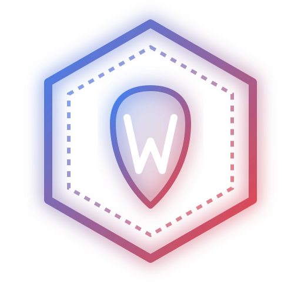
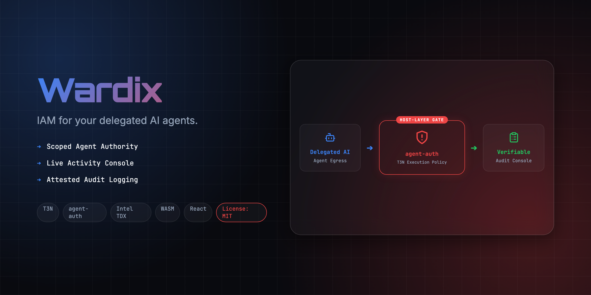
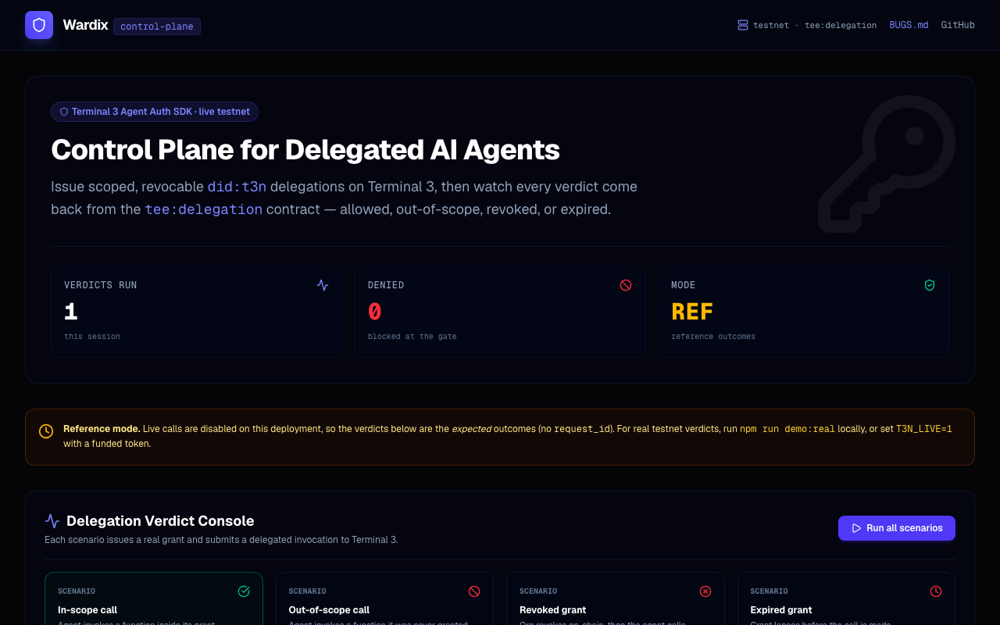
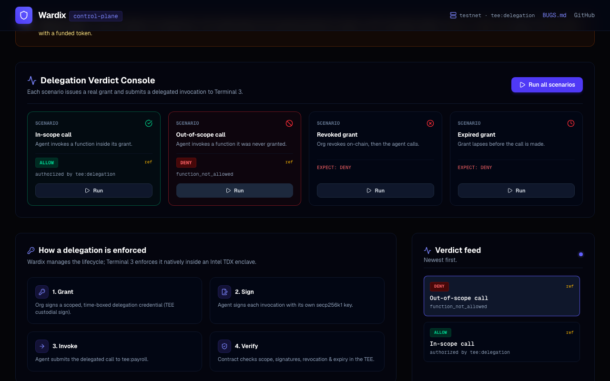
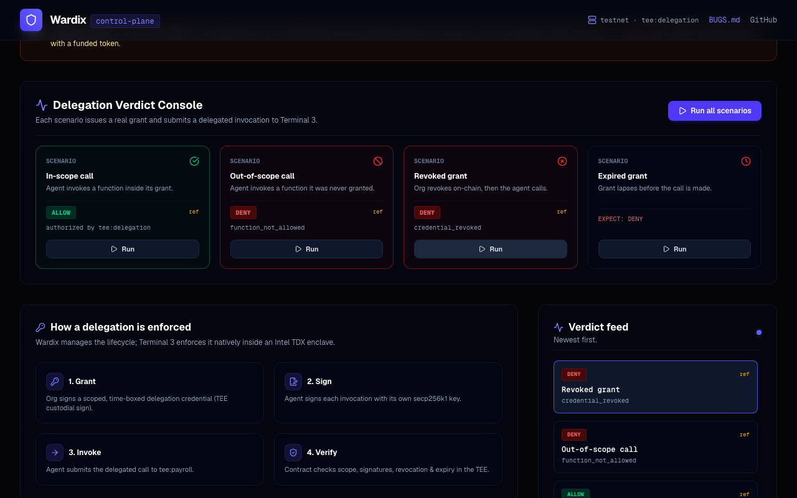
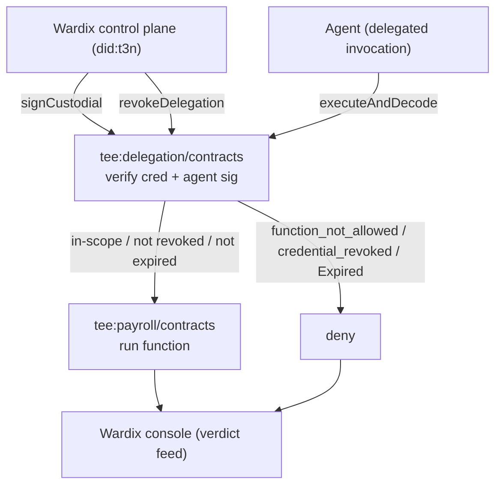

<div align="center">
  

  <h1>Wardix 🔑</h1>
  <p><em>IAM & Control Plane for Delegated AI Agents</em></p>
  

  <br/>

  [](https://wardix.edycu.dev)
  [](https://youtu.be/aYhjJqaob7c)
  [](https://dorahacks.io/hackathon/t3adkdevchallengebeta)
  [](https://dorahacks.io/buidl/44424)
  <br/>

  
  
  
  [](https://github.com/edycutjong/wardix/actions/workflows/ci.yml)

</div>

---

> **Emotional Hook:** At 3am, Sam — the lone ops engineer at a 12-person fintech — got paged: their payroll-running AI agent, fed a poisoned cycle file, tried to push a disbursement it was never authorized to make. It didn't clear — because the grant behind it was scoped, capped, and revocable. Nobody had been managing those grants. Wardix is the control plane that issues, watches, and revokes them.

---

## 🎬 Submission Details

- **GitHub Repository**: [github.com/edycutjong/wardix](https://github.com/edycutjong/wardix)
- **Live Console**: [wardix.edycu.dev](https://wardix.edycu.dev)
- **Demo Video**: [https://youtu.be/aYhjJqaob7c](https://youtu.be/aYhjJqaob7c)
- **Real testnet demo**: `npm run demo:real` — four live verdicts from `tee:delegation` / `tee:payroll`
- **Sponsor Bounty tracks**:
  1. **Best Agent utilizing Terminal 3 Agent Auth SDK ($300)** (Primary)
  2. **Bug Discover Bounty ($200)** (Verified findings in [BUGS.md](docs/BUGS.md))

---

## 💡 The Problem

Enterprises are handing real authority to AI agents that run jobs and move money. But there's no IAM for agentic workflows. Who did the org delegate, to which agent, for which functions, until when — and how do you revoke a compromised agent *right now* and prove it? A prompt-injected agent shouldn't be able to act outside its grant, and someone needs to manage those grants.

## 🛡️ The Solution: Wardix

Terminal 3's enforcement primitive is the **User-to-Agent Delegation Credential**: a principal signs a scoped, capped, time-boxed grant authorizing a specific agent (by its secp256k1 public key) to call specific `functions` on a contract; the agent signs each invocation; the deployed contract verifies the whole chain **inside an Intel TDX enclave** and runs the action only if every check passes.

**Wardix** is a `did:t3n` control plane built on `@terminal3/t3n-sdk` that makes that primitive operable:

1. **Grant**: Issues a real delegation credential via the TEE custodial signer (`tee:delegation/contracts::sign`) — scoped functions + validity window.
2. **Invoke**: Submits a real delegated invocation to the deployed `tee:payroll` contract and surfaces the contract's own verdict.
3. **Revoke**: `tee:delegation/contracts::revoke` — the agent's next call is denied immediately.
4. **Observe**: Records every allow/deny with the live node's `request_id` in the console verdict feed.

Every verdict below is the real contract's, captured live from testnet:

| Scenario | Verdict | Reason (from `tee:delegation`) |
|---|---|---|
| In-scope call, valid grant | ✅ allow | `authorized by tee:delegation` |
| Function not in the grant | ❌ deny | `function_not_allowed` |
| After on-chain revoke | ❌ deny | `credential_revoked` |
| Grant past its window | ❌ deny | `Expired` |

Run it yourself: `npm run demo:real` (needs a funded `T3N_SANDBOX_TOKEN`).

---

## 🖼️ The Console

<div align="center">

| In-scope call → ✅ allow | Out-of-scope call → ❌ deny | Revoked / expired → ❌ deny |
|:---:|:---:|:---:|
|  |  |  |

*Every verdict is the `tee:delegation` contract's own decision, returned live from testnet with a real `request_id`.*

</div>

---

## ⚙️ Architecture



### Terminal 3 SDK surface used (real)
- **`tee:delegation/contracts`**: `sign` (issue grant) + `revoke` — the agent-auth core.
- **`tee:payroll/contracts`**: the scoped delegated target (`compute-payroll`, `execute-disbursement`, …).
- **`tee:user/contracts`**: `did:t3n` identity + TEE-managed wallet.
- **Auth**: `handshake` → `authenticate(createEthAuthInput)`; custodial signing via `DelegationCustodialClient`.
- **Attestation**: `verifyTdxQuote` / `verifyDkgAttestation` (Intel TDX).

---

## 🚀 Getting Started

### Prerequisites
- Node.js >= 18

### Installation
```bash
# Clone the repository
git clone https://github.com/edycutjong/wardix.git
cd wardix

# Install dependencies
npm install
```

### Environment Setup
Copy the example environment file:
```bash
cp .env.example .env.local
```
Then set `T3N_SANDBOX_TOKEN` to a **funded testnet dev tenant private key** (claim one from the Terminal 3 Sandbox portal). This same key acts as the org + agent in the demo. See `.env.example` for `T3N_ENV`, `T3N_LIVE`, and the pinned `T3N_PAYROLL_VERSION`.

### Running the Real Testnet Demo
Issue a real delegation grant and submit real delegated invocations to the live `tee:payroll` contract — printing four contract-issued verdicts (allow / out-of-scope / revoked / expired), each with a node `request_id`:
```bash
npm run demo:real
```

### Live Verification Endpoint (opt-in)
With `T3N_LIVE=1` and a funded token set, `POST /api/verify` runs the same real flow through the app:
```bash
curl -s -X POST http://localhost:3000/api/verify \
  -H 'Content-Type: application/json' \
  -d '{"functions":["compute-payroll"],"call":"execute-disbursement"}'
# → { "verdict":"deny", "reason":"function_not_allowed…", "requestId":"…" }
```

### Running Test Suite (19 Tests)
Run the Vitest suite (UI, the live `/api/verify` route, and adapter verdict classification):
```bash
npx vitest run
```

### Launching the Dashboard Console
Run the Next.js development server:
```bash
npm run dev
```
Open [http://localhost:3000](http://localhost:3000) to view the live dashboard.

---

## 🧪 Testing & CI

**6-stage pipeline:** Quality → Security → Build → E2E → Performance → Deploy

```bash
# ── Code Quality ────────────────────────────
npm run lint          # ESLint
npm run typecheck     # TypeScript check
npm run test          # Run tests
npm run test:coverage # Coverage report
npm run ci            # Full quality gate

# ── Advanced Testing ────────────────────────
npm run e2e           # Playwright E2E tests
npm run e2e:ui        # Playwright interactive mode
npm run lighthouse    # Lighthouse CI audit

# ── Security ────────────────────────────────
npm audit                          # dependency vulnerabilities
npx license-checker --production    # license compliance
```

| Layer | Tool | Status |
|---|---|---|
| Code Quality | ESLint + TypeScript | ✅ |
| Unit Testing | Vitest (19 tests) | ✅ |
| E2E Testing | Playwright (3 suites) | ✅ |
| Security (SAST) | CodeQL | ✅ |
| Security (SCA) | Dependabot + npm audit | ✅ |
| Secret Scanning | TruffleHog | ✅ |
| Performance | Lighthouse CI | ✅ |

---

## 🐞 Feedback & Bugs
Detailed ADK feedback and documentation recommendations are available in [BUGS.md](docs/BUGS.md).

## 📄 License
This project is licensed under the [MIT License](LICENSE) © 2026 Edy Cu.
