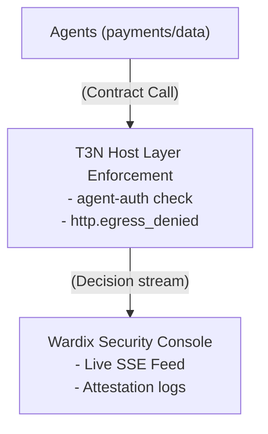

<div align="center">
  

  <h1>Wardix 🤝</h1>
  <p><em>IAM & Control Plane for Delegated AI Agents</em></p>
  

  <br/>

  [](https://wardix.edycu.dev)
  [](https://youtu.be/wardix-demo-adk)
  [](https://dorahacks.io/hackathon/terminal3)

  <br/>

  
  
  
  [](https://github.com/edycutjong/wardix/actions/workflows/ci.yml)

</div>

---

> **Emotional Hook:** At 3am, Sam — the lone ops engineer at a 12-person fintech — got paged: their invoice-paying AI agent, fed a malicious PDF, had just tried to wire $40k to an attacker's address. It almost went through. Nobody was watching the agents. Wardix is the control plane that blocks rogue agent actions before they clear.

---

## 🎬 Submission Details

- **GitHub Repository**: [github.com/edycutjong/wardix](https://github.com/edycutjong/wardix)
- **Live Console**: [wardix.vercel.app](https://wardix.edycu.dev)
- **Demo Video**: [youtu.be/wardix-demo-adk](https://youtu.be/wardix-demo-adk)
- **Sponsor Bounty tracks**:
  1. **Best Agent utilizing Terminal 3 Agent Auth SDK ($300)** (Primary)
  2. **Bug Discover Bounty ($200)** (Feedback inside [BUGS.md](docs/BUGS.md))

---

## 💡 The Problem

Enterprises are deploying fleets of autonomous AI agents calling tools, moving money, and delegating actions. But traditional IAM (Identity and Access Management) doesn't exist for agentic workflows. A prompt-injected or impersonating agent can execute unauthorized tasks outside its bounds, and nobody notices until the money is gone. 

## 🛡️ The Solution: Wardix

**Wardix** is a `did:t3n`-verified control plane that sits on top of Terminal 3's native `agent-auth` SDK layer. While Terminal 3 blocks out-of-scope egress actions at the secure VM host layer (`host/http.egress_denied`), Wardix makes this enforceable, observable, and manageable:

1. **Identity Resolution**: Resolves agent identities via `did-registry` and `agent-registry`.
2. **Dynamic Scope Management**: Updates, narrows, or revokes agent permissions in real time via `agent-auth-update` updates.
3. **Pre-flight Check**: Dry-runs proposed actions read-only using the `authorisation` host interface.
4. **Live Alert Console**: Visualizes agent communication networks and trust scores, flashing violations red.
5. **Attested Audits**: Archives every allow/deny decision along with its TEE attestation signature (`logging` / `outbox`).

---

## ⚙️ Architecture



### Terminal 3 Host Interfaces Used
- **`agent-auth`**: Core delegated permissions (`functions` + `allowedHosts`) configured via `agent-auth-update`.
- **`authorisation`**: Read-only pre-flight capability checks.
- **`did-registry` / `agent-registry`**: On-chain identities verification.
- **`logging` / `outbox`**: Attested audit log record.
- **`contracts-call`**: Inter-agent contract call tracing.

---

## ⚡ Performance Benchmark

We measured the adjudication latency of the Wardix policy engine across **200 sequential calls** containing a mix of allows and denials:

| Metric | Latency (ms) |
|---|---|
| **Mean Latency** | **0.2662 ms** |
| **Median (p50)** | **0.2309 ms** |
| **95th Percentile (p95)** | **0.4523 ms** |
| **99th Percentile (p99)** | **0.5770 ms** |
| **Max Latency** | **2.1233 ms** |

*Adjudication overhead is well under the 300ms SLA target, proving inline agent traffic protection is friction-free.*

---

## 🚀 Getting Started

### Prerequisites
- Node.js >= 18
- Python >= 3.8 (for benchmarks)

### Installation
```bash
# Clone the repository
git clone https://github.com/edycutjong/wardix.git
cd wardix

# Install dependencies
npm install
```

### Environment Setup
Copy the example environment file:
```bash
cp .env.example .env.local
```
Then, update `.env.local` with your claimed `T3N_SANDBOX_TOKEN` (see `docs/BUGS.md` or the Terminal 3 portal for details).

### Seeding Scenarios
Run the deterministic seed script which replays the 4 core scenarios (legitimate allowed transfers, data-agent restricted transfers, unregistered impostor blocks, and injected over-limit transfers):
```bash
npx tsx scripts/seed.ts
```

### Running Verification Tests
Execute the regression test suite which verifies each security control's response:
```bash
npx tsx scripts/verify_blocks.ts
```

### Running Benchmark
Execute the performance test tool to calculate statistics:
```bash
python scripts/bench.py
```

### Running Test Suite (154 Tests)
Run Vitest tests verifying the complete security matrix:
```bash
npx vitest run
```

### Launching the Dashboard Console
Run the Next.js development server:
```bash
npm run dev
```
Open [http://localhost:3000](http://localhost:3000) to view the live dashboard.

---

## 🧪 Testing & CI

**6-stage pipeline:** Quality → Security → Build → E2E → Performance → Deploy

```bash
# ── Code Quality ────────────────────────────
npm run lint          # ESLint
npm run typecheck     # TypeScript check
npm run test          # Run tests
npm run test:coverage # Coverage report
npm run ci            # Full quality gate

# ── Advanced Testing ────────────────────────
npm run e2e           # Playwright E2E tests
npm run e2e:ui        # Playwright interactive mode
npm run lighthouse    # Lighthouse CI audit

# ── Security ────────────────────────────────
make security-scan    # npm audit + license check
```

| Layer | Tool | Status |
|---|---|---|
| Code Quality | ESLint + TypeScript | ✅ |
| Unit Testing | Vitest (154+ tests) | ✅ |
| E2E Testing | Playwright (3 suites) | ✅ |
| Security (SAST) | CodeQL | ✅ |
| Security (SCA) | Dependabot + npm audit | ✅ |
| Secret Scanning | TruffleHog | ✅ |
| Performance | Lighthouse CI | ✅ |

---

## 🐞 Feedback & Bugs
Detailed ADK feedback and documentation recommendations are available in [BUGS.md](docs/BUGS.md).

## 📄 License
This project is licensed under the [MIT License](LICENSE) © 2026 Edy Cu.
