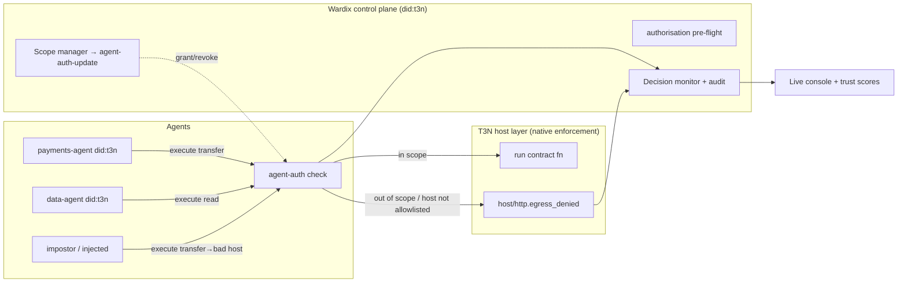

# ARCHITECTURE — Wardix

> API verified against `docs.terminal3.io` — see `../ADK_REFERENCE.md`. **Key correction:** T3N enforces agent scope **natively** via the `agent-auth` host interface — an agent that calls a function outside its grant or an unlisted host is blocked at the host layer (`host/http.egress_denied`). Wardix is **not** an external "A2A-bus interceptor" (there is no A2A/MCP/ERC-8004 in T3N). Wardix is the **control plane + observability layer** on top of `agent-auth` and `authorisation`.

## What Wardix actually is
The platform already does the blocking. Wardix makes it **manageable and visible**: grant/edit/**revoke** delegated scopes, run pre-flight permission checks, and surface every allow/deny with a tamper-evident audit trail.

## Tech Stack
- **Wardix core:** TypeScript + `T3nClient` (`handshake`, `authenticate(createEthAuthInput)`, `execute`/`executeAndDecode`)
- **Identity/registry:** `did:t3n` (`did-registry`), agents discoverable via `agent-registry`
- **Enforcement (native):** `agent-auth` (delegated `functions` + `allowedHosts`), `authorisation` (read-only pre-flight checks)
- **Audit:** `logging` + `outbox`, anchored by TEE attestation
- **Console:** Next.js + Tailwind + react-force-graph + SSE feed
- **Stub agents:** 3 tiny agents — `payments`, `data`, `impostor`

## System Diagram


## Core flow
1. **Grant** — Wardix sets an agent's scope via `agent-auth-update` (`functions`, `allowedHosts`).
2. **Pre-flight (optional)** — `authorisation` read-only check before a risky action.
3. **Enforce (native)** — agent executes; T3N runs it only if in scope, else `host/http.egress_denied`.
4. **Observe** — Wardix records every allow/deny (`logging`/`outbox` + attestation) → live console + trust score.
5. **Revoke** — Wardix updates the grant; the agent's next out-of-scope action is denied.

## Data Model
```ts
type Grant = { agentDid: string; scriptName: string; versionReq: string; functions: string[]; allowedHosts: string[] }
type Decision = { agentDid: string; fn: string; host?: string; verdict: 'allow'|'deny'; reason: string; attestation: string; ts: number }
type TrustScore = { agentDid: string; denials: number; lastSeen: number }
```

## API
| Method | Path | Purpose |
|---|---|---|
| POST | `/api/grants` | set/update an agent grant (→ `agent-auth-update`) |
| DELETE | `/api/grants/:agentDid` | revoke (narrow the grant) |
| GET | `/api/decisions/stream` (SSE) | live allow/deny stream |
| GET | `/api/agents` | topology + trust scores |
| POST | `/api/preflight` | `authorisation` check for a proposed action |

## Model Selection
No ML on the verdict path — enforcement is T3N's deterministic `agent-auth`, not a model that could be talked around (an LLM judge could itself be prompt-injected). Optional Claude Haiku **off-path** to summarize a denial into a readable alert.

## Host interfaces used (real, ≥3)
`agent-auth` · `authorisation` · `agent-registry` · `did-registry` · `logging`/`outbox` · `contracts-call` (cross-agent/cross-contract).
