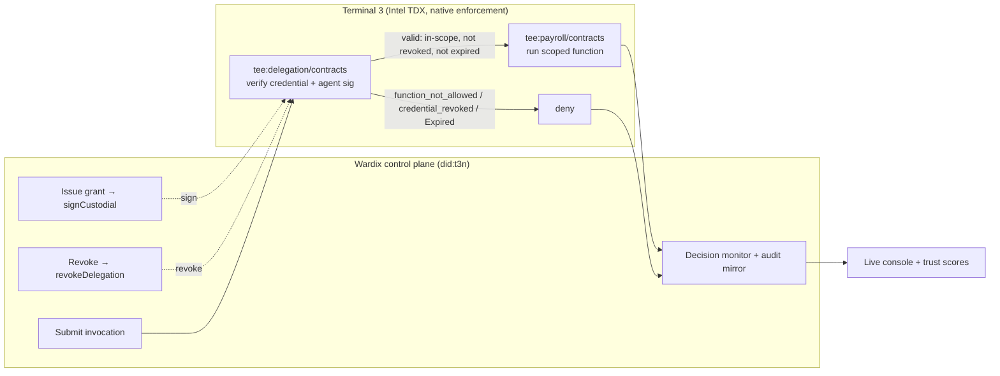

# ARCHITECTURE — Wardix

> Built against the **real** `@terminal3/t3n-sdk` (v3.5.0) on the live testnet.
> Terminal 3's enforcement primitive is the **User-to-Agent Delegation Credential**:
> a principal signs a scoped, capped, time-boxed grant authorizing an agent to call
> specific `functions` on a contract; the agent signs each invocation; the deployed
> contract verifies the chain inside an Intel TDX enclave and runs the action only if
> every check passes. Wardix is the **control plane + observability layer** on top of
> `tee:delegation/contracts`.

## What Wardix actually is
Terminal 3 does the blocking. Wardix makes it **manageable and visible**: issue /
revoke delegated grants, submit pre-flight invocations, and surface every
allow/deny verdict (with the live node's `request_id`) in a console.

## Tech Stack
- **Wardix core:** TypeScript + `@terminal3/t3n-sdk` `T3nClient` (`handshake`,
  `authenticate(createEthAuthInput)`, `executeAndDecode`)
- **Grants:** `buildDelegationCredential` + `DelegationCustodialClient.signCustodial`
  (TEE signs with the principal's primary wallet) → `tee:delegation/contracts::sign`
- **Invocation:** `buildPayrollInvocation` + agent secp256k1 signature →
  `tee:payroll/contracts::<fn>`
- **Revocation:** `revokeDelegation` → `tee:delegation/contracts::revoke`
- **Identity:** `did:t3n`, TEE-managed wallet via `tee:user/contracts`
- **Attestation:** `verifyTdxQuote` / `verifyDkgAttestation`
- **Console:** Next.js + Tailwind + SSE feed over a local grant/decision mirror

## System Diagram


## Core flow
1. **Grant** — Wardix builds a delegation credential (`functions`, `scopes`,
   validity window) and TEE-custodially signs it with the org's primary wallet.
2. **Invoke / pre-flight** — the agent assembles a delegated invocation (per-call
   agent signature) and submits it to `tee:payroll`.
3. **Enforce (native)** — `tee:delegation` verifies user sig, agent sig,
   function-in-scope, validity window, and revocation inside the TEE; the payroll
   function runs only if all pass.
4. **Observe** — Wardix records the verdict + `request_id` into its mirror → console.
5. **Revoke** — `revokeDelegation`; the agent's next call returns `credential_revoked`.

## Data Model
```ts
// Real credential (signed): @terminal3/t3n-sdk DelegationCredential
type Grant = { vcId: Uint8Array; functions: string[]; scopes: string[];
               notAfterSecs: number; credentialJcs: Uint8Array; userSig: Uint8Array }
// Wardix mirror row (no host read-back — see BUGS.md #1)
type Decision = { agentDid: string; fn: string; verdict: 'allow'|'deny';
                  reason: string; requestId?: string; ts: number }
```

## API
| Method | Path | Purpose |
|---|---|---|
| POST | `/api/verify` | **live**: issue grant + submit delegated invocation, return the real contract verdict (opt-in via `T3N_LIVE=1`) |
| POST | `/api/grants` | record/update a grant in the console mirror |
| DELETE | `/api/grants/:agentDid` | revoke (narrow the grant) in the mirror |
| GET | `/api/decisions/stream` (SSE) | live allow/deny stream |
| GET | `/api/agents` | topology + trust scores |
| POST | `/api/preflight` | local pre-flight check against the mirror |

## Real vs. mirror
- **Real (live testnet):** `npm run demo:real` and `POST /api/verify` — every verdict
  is `tee:delegation` / `tee:payroll`'s own, with a node `request_id`.
- **Mirror (console):** the visual dashboard reads a local cache of issued grants and
  recorded decisions, because the host exposes no read-back for active credentials.
  This is a documented limitation, not a simulation of the verdict.

## Model Selection
No ML on the verdict path — enforcement is Terminal 3's deterministic, TEE-attested
delegation contract, not a model that could be prompt-injected. Optional Claude Haiku
**off-path** to summarize a denial into a readable alert.

## Host interfaces / contracts used (real)
`tee:delegation/contracts` (sign + revoke) · `tee:payroll/contracts` (scoped target)
· `tee:user/contracts` (identity/wallet) · `createEthAuthInput` auth · `verifyTdxQuote`
attestation.
